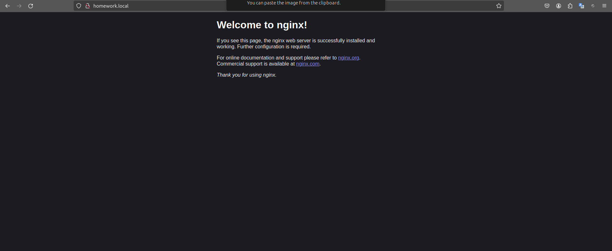
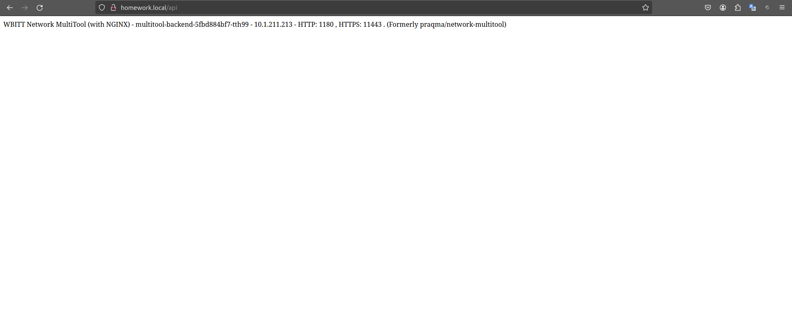

# Сетевое взаимодействие в K8S. Часть 2
<br>

## Задание 1. Создать Deployment приложений backend и frontend

Проверка работы внутренней сети развернутых deployments через srvices (приложения видят друга):

```
kubectl get service
NAME                TYPE        CLUSTER-IP       EXTERNAL-IP   PORT(S)    AGE
kubernetes          ClusterIP   10.152.183.1     <none>        443/TCP    48d
nginx-frontend      ClusterIP   10.152.183.61    <none>        8080/TCP   25m
multitool-backend   ClusterIP   10.152.183.234   <none>        8180/TCP   25m

kubectl get pod
NAME                                 READY   STATUS    RESTARTS   AGE
multitool-backend-5fbd884bf7-tth99   1/1     Running   0          25m
nginx-frontend-7c5ddbdf54-j88xp      1/1     Running   0          25m
nginx-frontend-7c5ddbdf54-bmsrr      1/1     Running   0          25m
nginx-frontend-7c5ddbdf54-wj6dm      1/1     Running   0          25m

kubectl exec -ti nginx-frontend-7c5ddbdf54-j88xp -- bash
root@nginx-frontend-7c5ddbdf54-j88xp:/# curl 10.152.183.234:8180
WBITT Network MultiTool (with NGINX) - multitool-backend-5fbd884bf7-tth99 - 10.1.211.213 - HTTP: 1180 , HTTPS: 11443 . (Formerly praqma/network-multitool)
root@nginx-frontend-7c5ddbdf54-j88xp:/# exit
exit

kubectl exec -ti multitool-backend-5fbd884bf7-tth99 -- bash
multitool-backend-5fbd884bf7-tth99:/# curl 10.152.183.61:8080
<!DOCTYPE html>
<html>
<head>
<title>Welcome to nginx!</title>
<style>
html { color-scheme: light dark; }
body { width: 35em; margin: 0 auto;
font-family: Tahoma, Verdana, Arial, sans-serif; }
</style>
</head>
<body>
<h1>Welcome to nginx!</h1>
<p>If you see this page, the nginx web server is successfully installed and
working. Further configuration is required.</p>

<p>For online documentation and support please refer to
<a href="http://nginx.org/">nginx.org</a>.<br/>
Commercial support is available at
<a href="http://nginx.com/">nginx.com</a>.</p>

<p><em>Thank you for using nginx.</em></p>
</body>
</html>
```

## Задание 2. Создать Ingress и обеспечить доступ к приложениям снаружи кластера

1. Проверка работы ingress. Frontend:



<br>

2. Проверка работы ingress. Backend (API):

